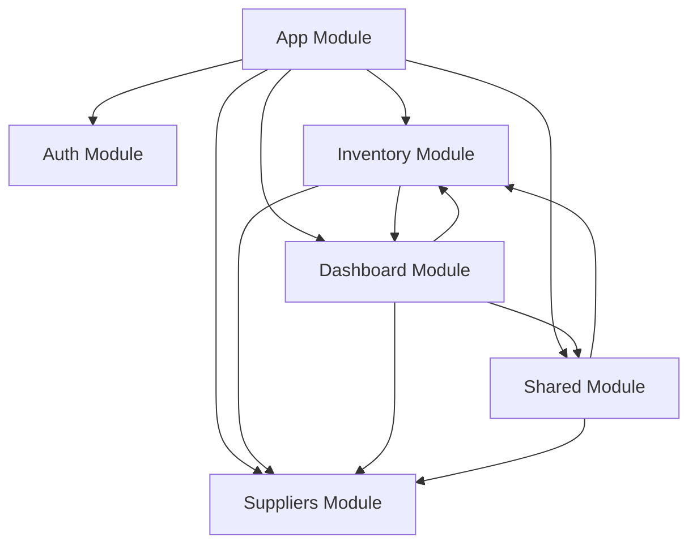

# Backend Folder Structure

This document describes the modular architecture of the inventory management backend.

## Overview

The backend has been restructured into separate modules for better maintainability and scalability:

- **Inventory Module**: Manages products, categories, shipments, and order items
- **Suppliers Module**: Handles supplier-related functionality
- **Dashboard Module**: Contains dashboard statistics and transaction management  
- **Shared Module**: Common entities and services used across modules
- **Auth Module**: Authentication and authorization

## Module Structure

### 📦 Inventory Module (`src/inventory/`)
```
inventory/
├── entities/
│   ├── product.entity.ts          # Product entity
│   ├── category.entity.ts         # Category entity  
│   ├── shipment.entity.ts         # Shipment entity
│   ├── shipment-item.entity.ts    # Shipment items
│   └── order-item.entity.ts       # Order items
├── dtos/
│   ├── create-product.input.ts    # Product creation DTO
│   ├── update-product.input.ts    # Product update DTO
│   └── create-category.input.ts   # Category creation DTO
├── models/
│   ├── product.model.ts           # GraphQL product model
│   └── category.model.ts          # GraphQL category model
├── inventory.service.ts           # Product service
├── category.service.ts            # Category service
├── inventory.resolver.ts          # Product resolver
├── category.resolver.ts           # Category resolver
├── inventory.module.ts            # Inventory module definition
└── index.ts                       # Barrel exports
```

### 🏪 Suppliers Module (`src/suppliers/`)
```
suppliers/
├── entities/
│   └── supplier.entity.ts         # Supplier entity
├── dtos/
│   ├── create-supplier.input.ts   # Supplier creation DTO
│   └── update-supplier.input.ts   # Supplier update DTO
├── models/
│   └── supplier.model.ts          # GraphQL supplier model
├── supplier.service.ts            # Supplier service
├── supplier.resolver.ts           # Supplier resolver
├── suppliers.module.ts            # Suppliers module definition
└── index.ts                       # Barrel exports
```

### 📊 Dashboard Module (`src/dashboard/`)
```
dashboard/
├── entities/
│   └── transaction.entity.ts      # Transaction entity
├── models/
│   └── dashboard.model.ts         # Dashboard GraphQL models
├── dashboard.service.ts           # Dashboard service
├── dashboard.resolver.ts          # Dashboard resolver
├── dashboard.module.ts            # Dashboard module definition
└── index.ts                       # Barrel exports
```

### 🤝 Shared Module (`src/shared/`)
```
shared/
├── entities/
│   ├── customer.entity.ts         # Customer entity
│   └── employee.entity.ts         # Employee entity
├── services/
│   └── seed.service.ts            # Database seeding service
├── shared.module.ts               # Shared module definition
└── index.ts                       # Barrel exports
```

### 🔐 Auth Module (`src/auth/`)
```
auth/
├── guards/
│   └── admin.guard.ts             # Admin authorization guard
├── strategies/
│   └── jwt.strategy.ts            # JWT authentication strategy
├── auth.service.ts                # Authentication service
├── auth.resolver.ts               # Auth resolver
└── auth.module.ts                 # Auth module definition
```

## Entity Relationships

### Cross-Module Dependencies
- **Shipment** (Inventory) → **Supplier** (Suppliers)
- **OrderItem** (Inventory) → **Transaction** (Dashboard)
- **Transaction** (Dashboard) → **Customer**, **Employee** (Shared)
- **Dashboard Service** → **Product** (Inventory), **Supplier** (Suppliers)

## Module Dependencies



## Benefits of This Structure

1. **Separation of Concerns**: Each module handles a specific domain
2. **Maintainability**: Easier to locate and modify features
3. **Scalability**: New features can be added as separate modules
4. **Testability**: Modules can be tested in isolation
5. **Code Reusability**: Shared components are centralized
6. **Clear Dependencies**: Module relationships are explicit

## Running the Application

```bash
# Install dependencies
npm install

# Build the application
npm run build

# Start in development mode
npm run start:dev

# Start in production mode
npm run start:prod
```

## GraphQL Schema

The GraphQL schema is auto-generated from the resolvers in each module and can be found at `src/schema.gql` after building the application.

## Database Entities

All database entities are properly organized by their domain:
- **Inventory**: Product, Category, Shipment, ShipmentItem, OrderItem
- **Suppliers**: Supplier
- **Dashboard**: Transaction
- **Shared**: Customer, Employee

## Future Enhancements

Consider adding these modules as the application grows:
- **Reports Module**: For advanced reporting features
- **Notifications Module**: For system notifications
- **Analytics Module**: For business intelligence
- **User Management Module**: For user administration